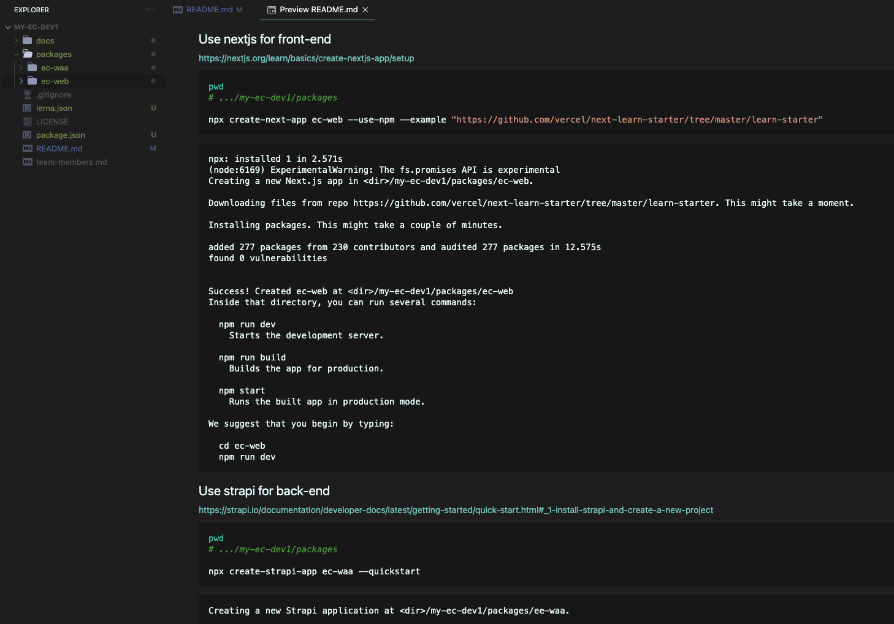

# my-ec-dev1
This is an e-commerce website

# Setup

```bash
node -v
# v11.10.1

npm i -g lerna
lerna init

## output
# (node:5988) ExperimentalWarning: queueMicrotask() is experimental.
# lerna notice cli v4.0.0
# lerna info Creating package.json
# lerna info Creating lerna.json
# lerna info Creating packages directory
# lerna success Initialized Lerna files

cd packages
```

## Use nextjs for front-end

https://nextjs.org/learn/basics/create-nextjs-app/setup

```bash
pwd
# .../my-ec-dev1/packages

npx create-next-app ec-web --use-npm --example "https://github.com/vercel/next-learn-starter/tree/master/learn-starter"
```

```log
npx: installed 1 in 2.571s
(node:6169) ExperimentalWarning: The fs.promises API is experimental
Creating a new Next.js app in <dir>/my-ec-dev1/packages/ec-web.

Downloading files from repo https://github.com/vercel/next-learn-starter/tree/master/learn-starter. This might take a moment.

Installing packages. This might take a couple of minutes.

added 277 packages from 230 contributors and audited 277 packages in 12.575s
found 0 vulnerabilities


Success! Created ec-web at <dir>/my-ec-dev1/packages/ec-web
Inside that directory, you can run several commands:

  npm run dev
    Starts the development server.

  npm run build
    Builds the app for production.

  npm start
    Runs the built app in production mode.

We suggest that you begin by typing:

  cd ec-web
  npm run dev
```

## Use strapi for back-end

https://strapi.io/documentation/developer-docs/latest/getting-started/quick-start.html#_1-install-strapi-and-create-a-new-project

```bash
pwd
# .../my-ec-dev1/packages

npx create-strapi-app ec-waa --quickstart
```

```log
Creating a new Strapi application at <dir>/my-ec-dev1/packages/ee-waa.

Creating a quickstart project.
Creating files.
Dependencies installed successfully.

Your application was created at <dir>/my-ec-dev1/packages/ee-waa.

Available commands in your project:

  npm run develop
  Start Strapi in watch mode.

  npm run start
  Start Strapi without watch mode.

  npm run build
  Build Strapi admin panel.

  npm run strapi
  Display all available commands.

You can start by doing:

  cd <dir>/my-ec-dev1/packages/ee-waa
  npm run develop


> ee-waa@0.1.0 build <dir>/my-ec-dev1/packages/ee-waa
> strapi build "--no-optimization"

Building your admin UI with development configuration ...

✔ Webpack
  Compiled successfully in 36.63s

Running your Strapi application.

> ee-waa@0.1.0 develop <dir>/my-ec-dev1/packages/ee-waa
> strapi develop

[2021-04-27T16:53:25.328Z] info File created: <dir>/my-ec-dev1/packages/ee-waa/extensions/users-permissions/config/jwt.js

 Project information

┌────────────────────┬──────────────────────────────────────────────────┐
│ Time               │ Tue Apr 27 2021 23:53:26 GMT+0700 (Indochina Ti… │
│ Launched in        │ 13290 ms                                         │
│ Environment        │ development                                      │
│ Process PID        │ 7887                                             │
│ Version            │ 3.1.4 (node v11.10.1)                            │
│ Edition            │ Community                                        │
└────────────────────┴──────────────────────────────────────────────────┘

 Actions available

One more thing...
Create your first administrator 💻 by going to the administration panel at:

┌─────────────────────────────┐
│ http://localhost:1337/admin │
└─────────────────────────────┘

[2021-04-27T16:53:27.360Z] debug HEAD /admin (10 ms) 200
[2021-04-27T16:53:27.365Z] info ⏳ Opening the admin panel...
[2021-04-27T16:53:28.478Z] debug GET /admin (4 ms) 200
[2021-04-27T16:53:28.571Z] debug GET /admin/runtime~main.66900c28.js (15 ms) 200
[2021-04-27T16:53:28.571Z] debug GET /admin/main.15f6d66d.chunk.js (4 ms) 200
[2021-04-27T16:53:29.524Z] debug GET /admin/init (15 ms) 200
[2021-04-27T16:53:29.534Z] debug GET /favicon.ico (1 ms) 200
[2021-04-27T16:53:29.647Z] debug GET /admin/6301a48360d263198461152504dcd42b.svg (2 ms) 200
[2021-04-27T16:53:29.735Z] debug GET /admin/3f6f46544e110a51499353fdc9d12bfe.png (3 ms) 200
[2021-04-27T16:53:29.776Z] debug GET /admin/cccb897485813c7c256901dbca54ecf2.woff2 (10 ms) 200
[2021-04-27T16:53:29.779Z] debug GET /admin/bd03a2cc277bbbc338d464e679fe9942.woff2 (10 ms) 200
[2021-04-27T16:53:29.783Z] debug GET /admin/8b4f872c5de19974857328d06d3fe48f.woff2 (12 ms) 200
```

## Done initialization

Our project would look like below



- Our back-end code will be located at: [./packages/ec-waa/api](./packages/ec-waa/api)
- Our front-end code will be located at: [./packages/ec-web/pages](./packages/ec-web/pages)
